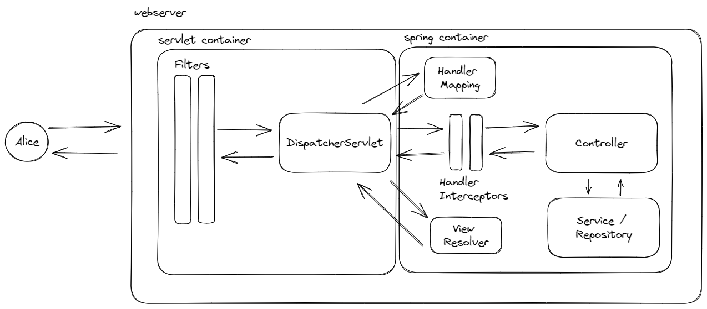

# Spring Boot MVC

This project attempt to showcase a sample `Spring Boot MVC` project, and the ecosystem surrounding it.

## 5 min Intro

`Spring Framework` provides the foundation for everything there is to `Spring`. The features it provides are:

- Core
  - Dependency Injection
  - Events
  - Validation
  - SpEL (Spring Expression Language)
  - AOP
- Testing
  - TextContext Framework
- Data Access
  - Transaction
  - JDBC
  - ORM
- Spring MVC and Spring WebFlux
- Integration
  - JMS
  - JMX
  - Cache
  - Scheduling

Whereas, `Spring Boot` simplify development by

- Embedding Webserver such as `Tomcat, Jetty or Undertow`
- Provide `starter` dependencies
  - Remove boilerplate codes
- @SpringBootApplication
  - @SpringBootConfiguration
  - @EnableAutoConfiguration
  - @ComponentScan
- Provide health check, metrics, and externalized configuration
  - Actuator

## Lifecycle



- Request hits the servlet container
- Pass through a series of `Filters`
- Reaching the `DispatcherServlet` which is also known as the `Front Controller`
- Hands off the request to `Handler Mapping`
  - Define a mapping between requests and handler objects
- Pass on the request to `Handler Interceptors`
  - Perform `pre and post` action
- Pass on to `Controller`
- Pass on to `View Resolver`
- Response back to `Client`

## Annotation

### Core

- @Bean
- @Primary
- @Qualifier
- @Value
- @Configuration
- @ConfigurationProperties
- @Autowired
- @Profile
- @ComponentScan
- @Transactional

### Sterotype

- @Component
- @Service
- @Repository
- @Controller
- @RestController

### Lifecycle

- @PostContruct
- @PreDestroy

### Web

- @RequestMapping
- @RequestBody
- @GetMapping
- @PostMapping
- @PatchMapping
- @PutMapping
- @DeleteMapping
- @ExceptionHandler
- @PathVariable
- @RequestParam
- @CrossOrigin

### Configuration

- @ConditionOnClass / MissingClass
- @ConditionOnBean / MissingBean
- @ConditionOnProperty
- @Conditional

### Test

- @SpringBootTest
- @TestConfiguration
- @TestPropertySource
- @ContextConfiguration
- @WebMvcTest
- @WebFluxTest
- @JdbcTest
- @DataJpaTest
- @DataMongoTest
- @JsonTest
- @RestClientTest

## Demo

- Refer to code
- To include
  - @RestController
  - @RequestMapping, @GetMapping, @PostMapping, @PutMapping, @DeleteMapping
  - @PathVariable, @RequestParam
  - @Valid, @Validated
  - @ControllerAdvice
  - @Cache
  - @EventListener
  - @AuthenticatedPrincipal
  - Converter
  - Interceptor
  - Filters
  - AOP
  - @WebMvcTest
  - @MongoDataTest
  - Application Properties
- Demostrate
  - Constructor Injection
  - @ConfigurationProperties
  - MapStruct
  - Lombok
  - Jackson Configuration
  - Mongo Converter
  - Custom Jackson Serializer / Deserializer
  - HandlerMethodArgumentResolver
- Plan
  - API
    - Go through a standard CRUD API flow
      - Add @RestController, followed by CRUD
      - @Transactional
    - Then build things up from here
      - @PathVariable, @RequestParam
      - @Valid, @Validated
    - Then add exception handling
      - @ControllerAdvice
    - Then add some test
      - @WebMvcTest, @MongoDataTest
  - Application Properties
    - .properties / .yaml
    - profiles
    - @ConfigurationProperties
    - @Value
    - 14 entry point
  - Use Case
    - I want to perform some logging at each request
      - Filters
      - Interceptor
    - I want to run some things on application startup
      - ApplicationRunner
      - ApplicationReadyEvent
      - CommandLineRunner
    - I want to do some action based on event
      - @EventListener
    - I want to know who is the current user
      - @AuthenticatedPrincipal
    - I want to do some custom json serializer / deserializer
      - @Json???
    - I want to cache my dataset
      - @Cache
    - I want to solve a cross cutting concern
      - AOP
    - I want to introduce a new annotation on my controller to handle (resolve)
      - HandlerMethodArgumentResolver
    - I want to have a custom validation annotation and logic
      - Validator
    - I want to do pagination
      - Page vs Slice
    - I want Spring to manage my object
      - @Bean

## Commit Flow

- Pre-note
  - Will not be diving too much into Lombok annotation, but do ask if you need any clarification
  - *to talk about the best practice along the way

### Commit 1

- There are a lot of stuff, with just a couple of files here, let's try to disect it.
  - Entry Point - `@SpringBootApplication`
    - `@EnableAutoConfiguration`: configure beans based on classpath
    - `@SpringBootConfiguration`: similar to @Configuration but one definition per application, to register extra beans in the context
    - `@ComponentScan`: scan the packages to register beans into ApplicationContext
  - Rest
    - Illustrate using `Profile`
    - `@RestController` combination of
      - `@Controller`
      - `@ResponseBody`: Serialize response into `HttpResponse`
      - Prior to `Spring 4.0`, you have to annotate `@ResponseBody` on every single controller method to convert from `Java Object` into `HttpResponse`
      - You definitely know about `@RequestBody` which deserialize from `HttpRequest` into `Java Object [Dto/Do]`
    - `@RequestMapping` map a incoming request to a specific handler
      - Since `Spring 4.3`, shorthand annotation was added
        - `@GetMapping`
        - `@PostMapping`
        - `@PutMapping`
        - `@PatchMapping`
        - `@DeleteMapping`
      - It is possible to map multiple endpoint to a single handler
    - `@PathVariable`
      - No need to declare value if the variable and pathVariable is same name
      - Can have more than one per method handler
    - `@RequestParams`
      - This is the params passed through URL after ?
      - We use `Spring Data Derived Query Method` to allow us to generate new query by method name
    - Showcase `findByName` API call
      - Turn on debug logging; see console

### Commit 2 - Exception Handling

- Exception handling can be handled for per exception, controller, and globally

#### Default

- Call `/profiles/exception`
- Will see such message

```json
{
    "timestamp": "2023-01-15T10:12:50.926+00:00",
    "status": 500,
    "error": "Internal Server Error",
    "trace": "java.lang.RuntimeException: demo\r\n\tat com.bwgjoseph.springbootmvc.profile....",
    "message": "default exception",
    "path": "/api/v1/profiles/exception"
}
```

- This is the default error response if there is no specific handler

#### Per Exception

* Controlled via `@ResponseStatus`

- Now, let's introduce custom exception `ProfileResponseStatusException` with `@ResponseStatus`
- Call `/profiles/response-status-exception`

```json
{
    "timestamp": "2023-01-15T10:12:50.926+00:00",
    "status": 400,
    "error": "Bad Request",
    "trace": "java.lang.RuntimeException: demo\r\n\tat com.bwgjoseph.springbootmvc.profile....",
    "message": "profile response status exception",
    "path": "/api/v1/profiles/response-status-exception"
}
```

#### Per Controller

* Controlled via `@ExceptionHandler` within each controller

- Call `/profiles/profile-exception`
- Will return `handle profile exception`


#### @RestControllerAdvice

* Controlled via `@RestControllerAdvice` for all controllers

- Call `/profiles/profile-exception`
- Will still return `handle profile exception` as the previous setup will still handle it even with global handler
- Remove local `@ExceptionHandler` and see how it went

### Commit 3 - Spring Converter

- First thing first, let's introduce a `Data Transfer Object` also known as `DTO`
  - Separation of concern between DTO and DO
  - Request is not the same as Response
- Let's make some changes to the `@PostMapping`
  - ProfileRequest > Profile
  - Profile > ProfileResponse
  - Write `Converters` and register them via `@Component`
    - Alternatively, can be register via `FormatterRegistry` in `@Configuration`
- Use `ConversionService` to trigger the conversion between the various format
- Converter can be used for any class, and does not have to be for this specific use case
  - For example, converting between `String date` to `LocalDate date`

### Commit 4 - Exploring MapStruct

- Can we do better? Maybe? Let's try out `MapStruct`
- `MapStruct` is a bean mapping library
- It provides great default feature out of the box, and allow customization when required
- Create `ProfileMapper` interface
  - Specify the two method
  - See generated source code
- See updated `ProfileController @PostMapping`
  - Not much difference in terms of lines of code
  - But it saves you from manual conversion

### Commit 5 - Validation

- Validation Annotation
  - `@NotNull, @NotEmpty, @NotBlank, @Min, @Max, @Email, @Pattern`
- Two way to trigger validation
  - `@Validated` at class level
  - `@Valid` at method level
  - Can be used anyway, not just `Controllers`
- Can also use to validate `@PathVariable` and `@RequestParam`
- Added custom validator annotation `@NameFormat`
  - Trigger via postman to see

> Above should roughly conclude the very simple overview of a normal CRUD API

> Now, we shall zoom into a bit more use case demo

### Use Case 1 - I want to run some action on application startup

- ApplicationRunner
- CommandLineRunner
- ApplicationEvent

> There's also @PostConstruct but that's more for Bean specific action, that comes with @PreDestroy

### Use Case 2 - Reacting to changes via Events (Pub/Sub)

- Spring provides ApplicationEvent, ApplicationEventPublisher, and ApplicationEventListener
- Can create own custom event
- Can listen to Spring Event or own event
- Supports async, transactional event as well
- Start the application, and will see

```
2023-01-16T01:56:15.911+08:00  INFO 9056 --- [  restartedMain] c.b.s.u.s.ApplicationRunnerStartup       : running ApplicationRunnerStartup commands
2023-01-16T01:56:15.911+08:00  INFO 9056 --- [  restartedMain] c.b.s.u.s.ApplicationRunnerStartup       : publishing mvc event
2023-01-16T01:56:15.911+08:00  INFO 9056 --- [  restartedMain] c.b.s.usecase.event.MvcEventListener     : source: com.bwgjoseph.springbootmvc.usecase.startup.ApplicationRunnerStartup@5858ad3a, message: mvc event
```

### Commit 6 - Supporting Pagination

*This should have been in the previous CRUD demo, but missed out, hence in here

> Pagination should not be a after thought

- Comes from `PagingAndSortingRepository` which provide `Page<T> findAll(Pageable pageable)`
- `PageRequest` is a implementation of `Pageable`
  - `PageRequest.of(page, size, Sort)`
- `Page` extends `Slice` where
  - `Page` provides `totalCount` and `totalPage`
- When to use `Page` or `Slice`?
  - Based from my understanding, `Slice` if you don't need to know the `total` (more performant).
  - For `Slice`, you must provide a field `Slice<T> findAllByXXX(String xxx, Pageable pageable)`
- Can use `@PageableDefault` to define defaults for `Pageable`
  - Note that `@PageableDefault` is from Spring and default size to 10, and `Pageable` is from Spring Boot and default size is 20

### Commit 7 - Test

#### @WebMvcTest

- See inline notes
- There are some common test such as
  - `@SpringBootTest, @DataMongoTest`
- And can integrate with `Spring Security` to ensure user with right access can only access allowed endpoint

### Use Case 3 - I want to log all my request and response

- There are three possible candidate `Filter, Interceptor, and AOP`
- See `RequestResponseFilter`
- See `RequestResponseInterceptor`, requires to register with `InterceptorRegistry`
- Key difference is
  - `Filter` handled at servlet, `Interceptor` handled at Spring Context
  - `Filter` is useful for `Authentication, Logging, Auditing, etc`, `Interceptor` is useful for `Authorization, Logging, etc`
- `AOP` is slightly different where it can target at any part of the codebase
  - Type of Advice: `before, after, after return, after throw, around`

### Use Case 4 - I want to have custom annotation at controller args

- Especially useful if we want to inject some value into the original request
- Or to extract a request value information
- I think that's how most of the common annotation works (@Valid @RequestBody @AuthenticationPrinciple)

Ref: https://www.springcloud.io/post/2022-09/springmvc-json-param/#gsc.tab=0, https://reflectoring.io/spring-boot-argumentresolver/

### Others

- I want to have typed-safe configuration; @ConfigurationProperties
- I want to write custom serializer / deserializer for API; @JsonComponent
- I want Spring to manage my object; @Bean
- I want to implement caching; @Cache
- I want to integrate with Spring Security; @AuthenticatedPrinciple
- I want to Spring to help generator audit info; @CreatedBy, @CreatedAt
- I want to write custom serializer / deserializer for Mongo; @ReadingConverter, @WritingConverter

## Notes

- use MongoTemplate#useEstimatedCount?
- devtools seem to reload for `./mvnw spring-boot:run` and not really for IDE although it works too
- should PUT endpoint require `id` as part of the payload?
  - this is tricky because w/o `id`, it can be seen as create if directly call `.save` method
  - https://stackoverflow.com/questions/27900041/rest-put-ids-in-body-or-not

## References

- [servlet-things-every-java-developer-must-know-servlet-container-filter-and-listener](https://medium.com/javarevisited/servlet-things-every-java-developer-must-know-servlet-container-filter-and-listener-374a460169bd)
- [spring-framework-filter-vs-dispatcher-servlet-vs-interceptor-vs-controller](https://medium.com/javarevisited/spring-framework-filter-vs-dispatcher-servlet-vs-interceptor-vs-controller-745aa34b08d8)
- [spring-3-mvc-and-interceptor-with](https://www.dineshonjava.com/spring-3-mvc-and-interceptor-with/)
- [Handler Interceptor](https://livenow14.tistory.com/61)
- [java-servlets-servlet-api-and-servlet-life-cycle](https://medium.com/@cyberblogger007/java-servlets-servlet-api-and-servlet-life-cycle-with-a-simple-demo-code-43a34c8bb785)
- [spring-boot-annotation-reference-01-a](https://foojay.io/today/spring-boot-annotation-reference-01-a/)
- [spring-boot-annotation-reference-01-b](https://foojay.io/today/spring-boot-annotation-reference-01-b/)
- [spring-boot-argumentresolver](https://reflectoring.io/spring-boot-argumentresolver/)
- [using-custom-arguments-in-spring-mvc-controllers](https://sadique.io/blog/2016/01/30/using-custom-arguments-in-spring-mvc-controllers/)