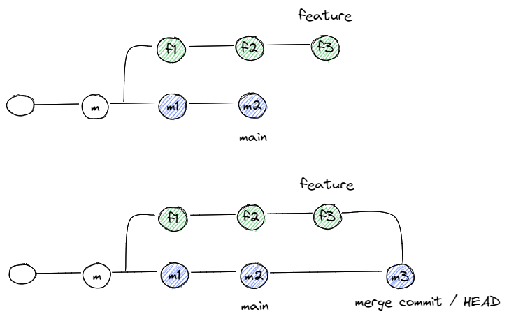
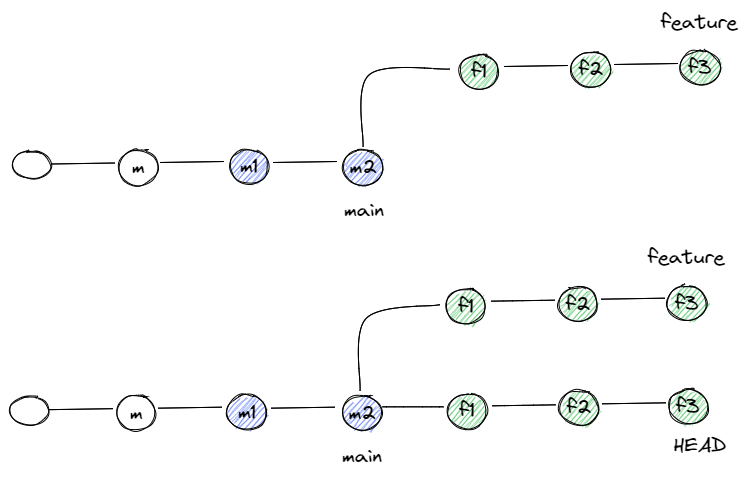
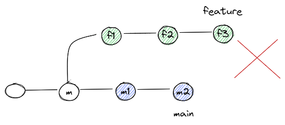
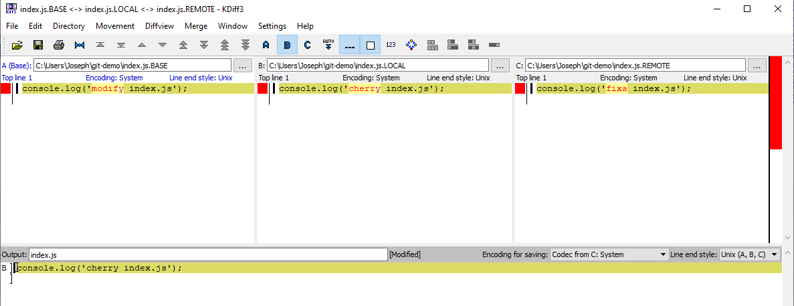
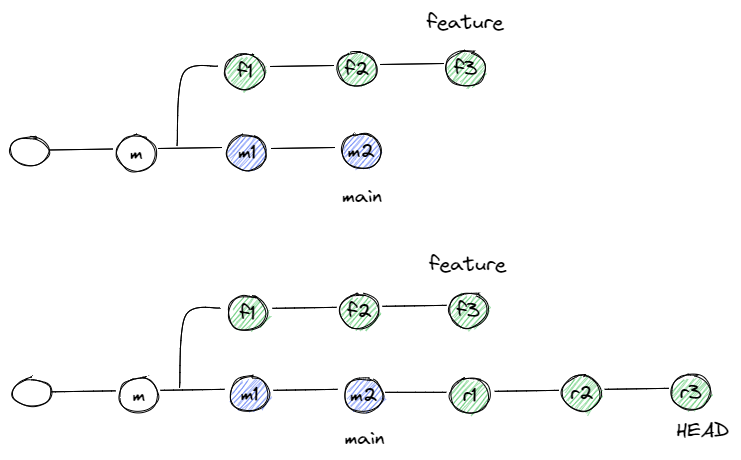

# Demo

- [Demo](#demo)
  - [Preparation](#preparation)
  - [Amend](#amend)
  - [Checkout](#checkout)
  - [Switch](#switch)
  - [Reset](#reset)
    - [Mixed](#mixed)
    - [Soft](#soft)
    - [Hard](#hard)
  - [Reflog](#reflog)
  - [Revert](#revert)
  - [Stash](#stash)
  - [Merge](#merge)
    - [No Fast Forward](#no-fast-forward)
    - [Fast Forward](#fast-forward)
    - [Dealing with Conflicts](#dealing-with-conflicts)
  - [Rebase](#rebase)
    - [Rebase Interactively](#rebase-interactively)
  - [Cherry Pick](#cherry-pick)
  - [Worktree](#worktree)

## Preparation

Let's prep a new git repository and some commits

```bash
mkdir ~/git-demo
cd ~/git-demo
git init --initial-branch=main
// prep with index.js file
echo "console.log('index.js');" > index.js
git status
// move to staged
git add index.js
// commit w/ message
git commit -m "add index.js"
// make some changes to index.js
echo "console.log('index2.js');" > index.js
git commit -am "modify index.js"
// fix changes to index.js
echo "console.log('fixa index.js');" > index.js
// typo in commit message
git commit -am "fixa index.js"
```

---

## Amend

Showcase how to amend the previous local commit

💡 Do not do this for remote public branch

```bash
// launch file editor
git commit --amend
// does not launch file editor
git commit --amend -m "fix index.js"
```

---

## Checkout

Showcase various ways to jump to specific branch or commit

```bash
// move to specific commit
git checkout 09bc267
// move back to HEAD
git checkout main
// -b will create branch
// Switch branches or restore working tree files
git checkout -b my-branch
```

---

## Switch

New command, an alternative to `checkout`, but more specifically target for switching branches

💡 no need to stash or anything before switching branch

```bash
// works exactly like checkout
// new command to prevent confusion
git switch -c my-new-branch
git branch -d my-new-branch
```

---

## Reset

To undo local changes done to the repository

```bash
echo "console.log('added.js');" > added.js
echo "console.log('modify index.js');" > index.js
git commit -am "some changes"
```

### Mixed

This is the default mode

💡 Commit undone, files back in working directory

```bash
git reset 16778df
```

### Soft

💡 Commit undone, new file back in working directory, modified file in staging

```bash
git commit -am "some changes"
git reset --soft 16778df
```

### Hard

💡 Commit undone, all files "resetted"

```
git add added.js
git commit -am "some changes"
git reset --hard 16778df
```

---

## Reflog

Even though we did a hard reset, and the files are gone, but is it really gone? Introducing `reflog`

```bash
git reflog
```

💡 Reflog keeps a history of changes

```bash
// reset to "some changes" commit
git reset --hard 0a7c6ab
```

💡 There's expiry to how much/long the history are stored

---

## Revert

(Abit) Similar to `reset` but this creates a new commit at `HEAD`

```bash
git revert 0a7c6ab
```

💡 Undo whatever changes that was done at that particular commit

💡 As mentioned previously that `reset` is to undo local change, `revert` is more towards undo-ing remote change

---

## Stash

Place existing changes to a temporarily holding area called `stash`

```bash
// make some changes to `index.js`
echo "console.log('stash index.js');" > index.js
git stash
```

Files are now in `stash`

```bash
git stash pop
```

Files are back now

💡 `git stash pop` remove the stash
💡 `git stash apply` does not remove from stash

---

## Merge

### No Fast Forward

💡 Always create merge commit



```bash
// modify `index.js`
echo "console.log('merge index.js');" > index.js
git switch -c my-merge-branch
```

Commit the change in `my-merge-branch`

```bash
git commit -am "update index.js"
```

Add new file `hello.js`

```bash
echo "console.log('hello.js');" > hello.js
git add .
git commit -m "add hello.js"
```

Merge `my-merge-branch` into `main`

```bash
// while in main
git switch main
git merge --no-ff my-merge-branch
```

Once merged, we can see there's a extra merge commit

### Fast Forward

Let's rewind back, and use ff merge instead

💡 Does not create merge commit

💡 Not always possible to perform a FF merge

💡 FF merge merely takes the main pointer to the tip



```bash
// rewind first
git reflog
git reset --hard 4b4e758 [checkout: moving from my-merge-branch to main]
// perform a ff merge
git merge --ff my-merge-branch
// clean up branch
git branch -d my-merge-branch
```

Notice there is no extra merge commit in ff merge

---

As mentioned, FF merge is not always possible. In the event where you are ahead, and behind the main branch



Git will not allow you to perform a FF merge. In this case, we can use `rebase` instead

---

### Dealing with Conflicts



Whenever there is a merge conflict, we have to resolve it manually. Let's take a look using the difftool

- **BASE**: origin content of both files before it splits branch
- **LOCAL**: content of the file in the current branch
- **REMOTE**: content of the file to be merged in

💡 For `rebase`, the meaning of `local` and `remote` is slightly different

---

## Rebase

Rewrites commit history

💡 Copies and replay the commit onto target branch (generates new commit id)



Create a new branch based off current main

```bash
git switch -c my-rebase-branch
```

Add `rebase.js`, modify `index.js`

```bash
echo "console.log('rebase.js');" > rebase.js
echo "console.log('rebase index.js');" > index.js
git add .
git commit -m "rebase.js"
```

Switch back to main to make some changes

```bash
// add change-in-main.js
git switch main
echo "console.log('change-in-main.js');" > change-in-main.js
git add .
git commit -m "change-in-main.js"
```

Now main in one commit ahead of rebase

Let's rebase `my-rebase-branch` onto `main`

```bash
git switch my-rebase-branch
git rebase main
```

---

### Rebase Interactively

Give you full control over `rebase` (rewriting history)

In `my-rebase-branch`, modify `rebase.js` to add new line for 3 commits

```bash
echo "console.log('rebase 2.js');" >> rebase.js
git commit -am "rebase2.js"
echo "console.log('rebase 3.js');" >> rebase.js
git commit -am "rebase3.js"
echo "console.log('rebase 4.js');" >> rebase.js
git commit -am "rebase4.js"
```

Then run `rebase -i` to squash `commit 2 into commit 1`

```bash
// clean up
git branch -D my-rebase-branch
```

---

## Cherry Pick

Picking specific commit from other branch into HEAD of current branch

```bash
git switch -c my-cherry-branch
echo "console.log('cherry index.js');" > index.js
git commit -am "cherry index.js"
// cherry pick from other branch
git switch main
git cherry-pick 10d3433
// clean up
git branch -D my-cherry-branch
```

---

## Worktree

Giving you ability to work on multiple branches at the same time without affecting each other

💡 Akin to `git clone` to a separate directory

Using UI, create worktree for `my-remote-branch`

```bash
git switch -c my-remote-branch
echo "console.log('remote.js');" > remote.js
git add .
git commit -m "remote.js"
git switch main
// to clean up after
```

💡 Very useful for looking into PR, and don't want to disturb your existing work